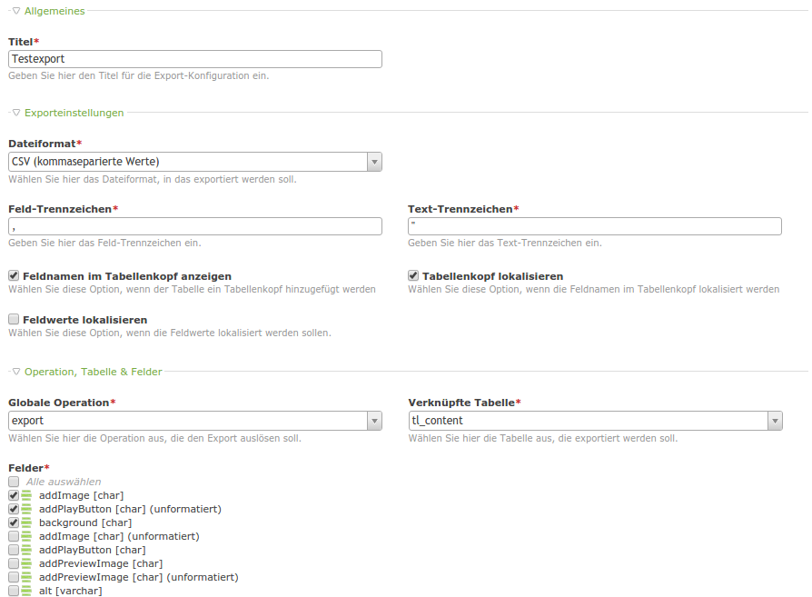

# Exporter

A backend module for exporting any contao entity.



*Export config preview*

## Technical instruction

### Step 1
Define your global operation in your entity's dca as follows:

```
'global_operations' => array
(
    'export_csv' => \HeimrichHannot\Exporter\Exporter::getGlobalOperation('export_csv',
                 $GLOBALS['TL_LANG']['MSC']['export_csv'],
                 'system/modules/exporter/assets/img/icon_export.png')
),
```

### Step 2
Add your backend module in your entity's config.php as follows:

```
$GLOBALS['BE_MOD']['mygroup'] = array
(
    'export_csv_' => \HeimrichHannot\Exporter\Exporter::getBackendModule()
),
```

### Step 3
Create a configuration for your export by using the exporter's backend module (group devtools).

## Features

### Classes

Name | Description
---- | -----------
CsvExporter | An exporter for writing entity instances into a CSV file
XlsExporter | An exporter for writing entity instances into an excel file (XLS)
MediaExporter | An exporter that combines all files referenced by the selected properties of an entity in one archive file (e.g. zip) preserving the folder structure

### Fields

tl_exporter:

Name | Description
---- | -----------
title | The export configuration's title
fileType | The type of exporter
fieldDelimiter | Determines the delimiter character (e.g. ,)
fieldEnclosure | Determines the enclosure character (e.g. ")
addHeaderToExportTable | Determines whether a header row is added to the export
compressionType | Determines the type of compression (atm zip only)
localizeHeader | Determines whether field names get localized
localizeFields | Determines whether field values also get localized
globalOperationKey | The operation key defined in your entity's dca
linkedTable | The entity's table to export
tableFieldsForExport | The table's fields to export (in most cases divided in formatted (e.g. 2016/01/20) and unformatted (e.g. 1453297849))

### Hooks

Name | Arguments | Expected return value | Description
---- | --------- | --------------------- | -----------
exporter_modifyHeaderFields | $arrFields, $objExporter | $arrFields | Modify the header fields just before just before being written to file
exporter_modifyMediaFilename | $objFile, $strFieldname, $varFieldValue, $objMediaExporter | $objFile->path | Modify a filename just before added to the archive when using *MediaExporter* (also folder structure could be modified here)